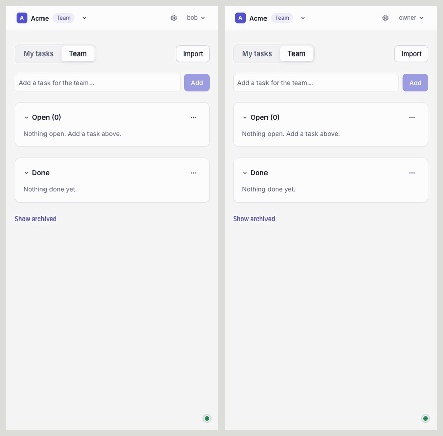

# Tadas

A multi-tenant to-do application for teams of people and the programs
that work alongside them. The system is built in the shape the Software
Design and Architecture Guidelines prescribe: one object model library
at the center (`om/`), one infrastructure toolkit (`infra/`), services
and workers around them, and apps at the edge.

<p align="center">
  
</p>

The portal in two windows, signed in as the two people `make seed` creates:
`owner@example.test` on the left, `bob@example.test` on the right, both on
Team's Tasks. Every task one of them adds or completes reaches the other over
the realtime channel as it happens. `make demo-gif` records it again from a
running `make up` stack (`scripts/record_demo.py`).

## Quick start

Requirements: uv, pnpm, Node 24.21.0 (see `.nvmrc`), Docker.

```bash
make up       # everything in containers, migrated and seeded, then prints the URLs
make down     # stop it all; the data stays for the next `make up`
make reset    # wipe all local data and containers, then `make up` again
make urls     # print the URLs and the sign-in again
```

`make up` creates `.env` from `.env.example` if it is missing, and is safe
to rerun: it rebuilds the app images from the working tree and seeds only
once. Once it is up:

| What | URL | Sign-in |
|------|-----|---------|
| Portal | http://localhost:55173 | `owner@example.test` (owner) or `bob@example.test` (member), both `tadas-local` |
| API docs (Swagger UI) | http://127.0.0.1:8000/docs | |
| pgweb (Postgres) | http://localhost:58081 | |
| Valkey Admin | http://localhost:58080 | add a connection: host `valkey`, port `6379`, no username or password |
| ElasticMQ UI (SQS) | http://localhost:53000 | |
| Grafana (metrics) | http://localhost:53001 | none; opens on the Tadas overview dashboard |
| Prometheus | http://localhost:59090 | |
| Jaeger (traces) | http://localhost:56686 | |
| GlitchTip (errors) | http://localhost:58000 | `admin@example.test` / `tadas-local` |
| MinIO console (S3) | http://localhost:59001 | `tadas` / `tadastadas` |

For one service at a time (rebuild only the API, reset only the database,
open `psql` or `valkey-cli`, follow logs) instead of a full `down`/`reset`,
see [deployment/local/README.md](deployment/local/README.md). The sections
below are the same steps one at a time, and the host-process alternative
for hot reload.

## Set up

```bash
make setup        # Python and TypeScript dependencies
cp .env.example .env
make infra-up     # Postgres, Valkey, ElasticMQ, MinIO on host ports 55432, 56379, 59324, 59000
make migrate      # every role's migration chain
make seed         # org "acme": owner@example.test (owner) and bob@example.test (member), both tadas-local
```

## Run

Pick one of two ways; both use the stack and the database from Set up.
Stop one before starting the other, since both use port 8000 for the API.

```bash
scripts/dev.sh    # on the host, with hot reload: API, worker, portal (Vite)
make stack-up     # in containers, built from the working tree: API, worker, portal (nginx)
```

Then sign in to the portal as `owner@example.test` or `bob@example.test`,
both with password `tadas-local` (from `make seed`). Sign in as each in two
browser windows to see "My Tasks" differ from "Team's Tasks" and to watch
changes arrive live.

| What | `scripts/dev.sh` | `make stack-up` |
|------|------------------|-----------------|
| Portal | http://localhost:5173 | http://localhost:55173 |
| API | http://127.0.0.1:8000 | http://127.0.0.1:8000 |
| API docs (Swagger UI) | http://127.0.0.1:8000/docs | http://127.0.0.1:8000/docs |
| API metrics (Prometheus) | http://127.0.0.1:8000/metrics | http://127.0.0.1:8000/metrics |

### Dashboards

The MinIO console comes with the stack: http://localhost:59001, user
`tadas`, password `tadastadas`.

For debugging, `make devx-up` adds developer dashboards next to the stack
(the compose `devx` profile). They are wired to the local services and
need no sign-in; they listen on 127.0.0.1 only.

| Dashboard | URL | Shows |
|-----------|-----|-------|
| pgweb | http://localhost:58081 | Postgres: schemas `core`, `activity`, `queue`, `admin`; run SQL |
| Valkey Admin | http://localhost:58080 | Valkey: keys, metrics, commands; add a connection to host `valkey`, port `6379`, no username or password |
| ElasticMQ UI | http://localhost:53000 | SQS queues and their messages |
| Grafana | http://localhost:53001 | Metrics: the Tadas overview dashboard over Prometheus, and Jaeger traces |
| Prometheus | http://localhost:59090 | Raw metrics from the api and the worker, as containers or host processes |
| Jaeger | http://localhost:56686 | Traces, once processes export them (below) |
| GlitchTip | http://localhost:58000 | Errors from the api, the worker, and the portal; sign in as `admin@example.test` / `tadas-local` |

Traces are off by default. To send them to Jaeger, uncomment
`TADAS_OTEL_ENDPOINT=http://127.0.0.1:54318` in `.env` and restart
`scripts/dev.sh`.

`make infra-down` stops every container, dashboards and app containers
included, and deletes the local data.

## Check

```bash
make check             # lint, format, types, unit tests (the fast gate)
make migrate-check     # every role's ORM metadata against the migrated schema
make test-integration  # the same storage contracts over Postgres, plus migrations
```

## Layout

- `om/` the object model: entities, managers, storage, migrations
- `infra/` cache, buckets, topics, queues, secrets, observability
- `services/` web services; `workers/` background roles; `apps/` clients
- `clients/` typed clients, one per service; `deployment/` compose, images, Terraform
- `docs/` as built, ADRs, runbooks; `scripts/` dev.sh and the cloud migration runner
