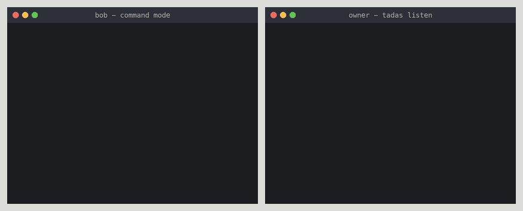

# Tadas

A multi-tenant to-do application for teams of people and the agents
that work alongside them. The system is built in the shape the Software
Design and Architecture Guidelines prescribe: one object model library
at the center (`om/`), one infrastructure toolkit (`infra/`), services
and workers around them, and apps at the edge.

<p align="center">
  
</p>

The portal in two windows, signed in as the two people `make seed` creates:
`owner@example.test` on the left, `bob@example.test` on the right, both on
Team's Tasks. Every task one of them adds or completes reaches the other over
the realtime channel as it happens. `make demo-gif` records it again from a
running `make up` stack (`scripts/record_demo.py`).

<p align="center">
  
</p>

The same thing from two terminals. On the left Bob works in command mode,
one `tadas` call at a time; on the right the owner runs `tadas listen` and
every change reaches the terminal over the same realtime channel the portal
uses, as one line: who did what to which task. `make demo-cli-gif` records
it from a running `make up` stack (`scripts/record_cli_demo.py`).

## Quick start

Requirements: uv, pnpm, Node 24.21.0 (see `.nvmrc`), Docker.

```bash
make up       # everything in containers, migrated and seeded, then prints the URLs
make down     # stop it all; the data stays for the next `make up`
make reset    # wipe all local data and containers, then `make up` again
make urls     # print the URLs and the sign-in again
```

`make up` creates `.env` from `.env.example` if it is missing, and is safe
to rerun: it rebuilds the app images from the working tree and seeds only
once. Once it is up:

| What | URL | Sign-in and what it shows |
|------|-----|---------------------------|
| Portal | http://localhost:55173 | `owner@example.test` (owner) or `bob@example.test` (member), both `tadas-local`; the two people `make seed` creates |
| API | http://127.0.0.1:8000 | Swagger UI at `/docs`, Prometheus metrics at `/metrics` |
| pgweb | http://localhost:58081 | Postgres: schemas `core`, `activity`, `queue`, `admin`; run SQL |
| Valkey Admin | http://localhost:58080 | Valkey: keys, metrics, commands; add a connection to host `valkey`, port `6379`, no username or password |
| ElasticMQ UI | http://localhost:53000 | SQS queues and their messages |
| Grafana | http://localhost:53001 | No sign-in; opens on the Tadas overview dashboard over Prometheus, and Jaeger traces |
| Prometheus | http://localhost:59090 | Raw metrics from the api and the worker, as containers or host processes |
| Jaeger | http://localhost:56686 | Traces, once processes export them (see Dashboards) |
| GlitchTip | http://localhost:58000 | `admin@example.test` / `tadas-local`; errors from the api, the worker, and the portal |
| MinIO console | http://localhost:59001 | `tadas` / `tadastadas`; the S3 buckets |

This table is the one place the local URLs live; every section below
refers back to it. For one service at a time (rebuild only the API, reset
only the database, open `psql` or `valkey-cli`, follow logs) instead of a
full `down`/`reset`, see
[deployment/local/README.md](deployment/local/README.md). The sections
below are the same steps one at a time, and the host-process alternative
for hot reload.

## The command line

`apps/cli` ships `tadas`: one command at a time, or `listen` for what the
team does as it happens. It signs in as one of the seeded people above
and keeps the session under `~/.config/tadas`.

```bash
uv run tadas login --email bob@example.test   # prompts for the password
uv run tadas add "Do groceries"
uv run tadas ls
uv run tadas done <id>                        # the short id ls shows; also edit, reopen, rm, mv
uv run tadas listen                           # every change, live; --mine for your own tasks
```

See [apps/cli/README.md](apps/cli/README.md) for the conventions and the
exit codes, and [clients/python/README.md](clients/python/README.md) for
the Python client every Python caller goes through.

## Set up

```bash
make setup        # Python and TypeScript dependencies
cp .env.example .env
make infra-up     # Postgres, Valkey, ElasticMQ, MinIO on host ports 55432, 56379, 59324, 59000
make migrate      # every role's migration chain
make seed         # org "acme" with the owner and the member of the table above (the SEED_* knobs in .env)
```

## Run

Pick one of two ways; both use the stack and the database from Set up.
Stop one before starting the other, since both use port 8000 for the API.

```bash
scripts/dev.sh    # on the host, with hot reload: API, worker, portal (Vite)
make stack-up     # in containers, built from the working tree: API, worker, portal (nginx)
```

The API is at the same address either way; only the portal's port differs:
`scripts/dev.sh` serves it from Vite on http://localhost:5173, `make
stack-up` from nginx on the port in the table above. Sign in as each of
the two seeded people in two browser windows to see "My Tasks" differ from
"Team's Tasks" and to watch changes arrive live.

### Dashboards

The MinIO console comes with the stack. For debugging, `make devx-up` adds
the developer dashboards of the table above (the compose `devx` profile):
pgweb, Valkey Admin, ElasticMQ UI, Grafana, Prometheus, Jaeger, GlitchTip.
They are wired to the local services and listen on 127.0.0.1 only. Their
ports are the defaults of the `TADAS_<DASHBOARD>_PORT` knobs in
`.env.example`; a clash is fixed by setting the knob in `.env`.

Traces are off by default. To send them to Jaeger, uncomment
`TADAS_OTEL_ENDPOINT=http://127.0.0.1:54318` in `.env` and restart
`scripts/dev.sh`.

`make down` stops every container, dashboards and app containers included,
and keeps the data for the next `make up`; `make reset` wipes the data too.
Those two are the shortcuts. The steps they wrap run one at a time, which
is what CI takes and what a developer debugging one of them runs:
`make setup`, `make infra-up` and `make infra-down` for the dependencies
alone, `make infra-reset` to recreate them with their volumes removed and
nothing else, `make migrate` and `make seed` for the database, and
`scripts/dev.sh` for the application on the host.

## Check

```bash
make check             # lint, format, types, unit tests (the fast gate)
make migrate-check     # every role's ORM metadata against the migrated schema
make test-integration  # the same storage contracts over Postgres, plus migrations
```

## Deploy

`main` is staging and `release` is production. Every merge to `main`
deploys staging with no approval; production moves when a person
dispatches the `release` workflow, which fast-forwards `release` to
`main`, and then approves the production plan. Nobody commits to
`release`. [docs/runbooks/deploy.md](docs/runbooks/deploy.md) has the
steps, the rollback, and the protection to set on the branch.

## Layout

- `om/` the object model: entities, managers, storage, migrations
- `infra/` cache, buckets, topics, queues, secrets, observability
- `services/` web services; `workers/` background roles; `apps/` clients: the
  portal, with its generated API types and one transport client under
  `src/api/` (a deadline on every call; the session in the tab's session
  storage, never local storage), and the CLI; `clients/python/` the one
  Python client
- `deployment/` compose, images, Terraform; the portal's distribution
  sends the security headers, a `Content-Security-Policy` naming its own
  origin and the API among them
- `docs/` as built, ADRs, runbooks; `scripts/` dev.sh, the portal publisher, and the by-hand migration runner
