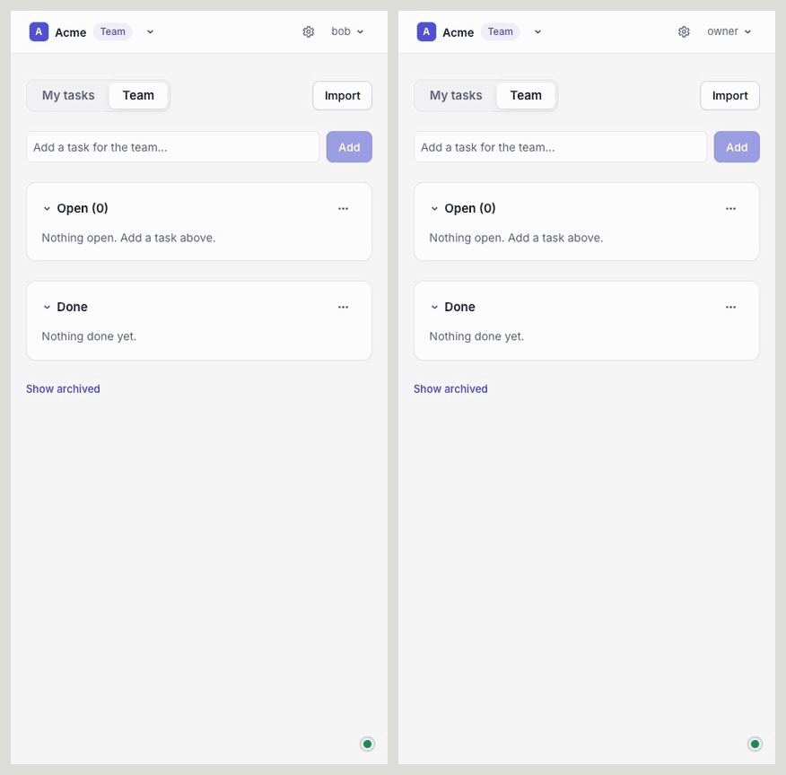
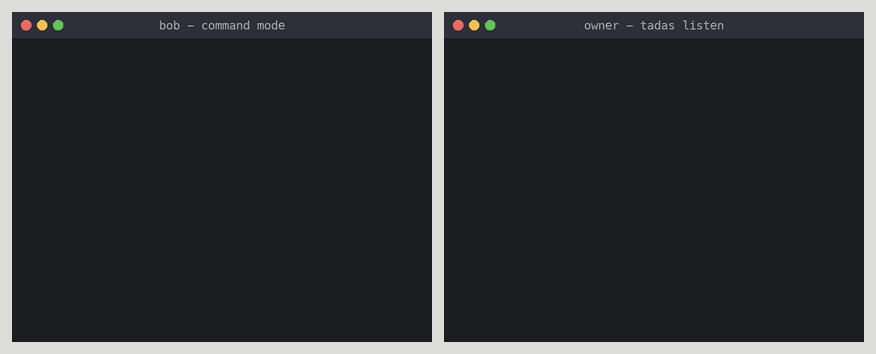

# Tadas

Tadas is a multi-tenant to-do application for teams of people and the
agents that work alongside them. A team keeps one list in the order it
chose, and every change reaches every open screen and terminal as it
happens.

Tadas is also the reference implementation of the Software Design and
Architecture Guidelines ([the pin](specs/architecture.md)): one object
model at the center, one infrastructure toolkit, an API process and a
maintenance worker around them, and a portal, a command line, and the
clients at the edge.

<p align="center">
  
</p>

Two of the seeded people on their team's list: each change Bob makes
reaches the owner's window as it happens. `make demo-gif` records it.

<p align="center">
  
</p>

The same from two terminals, with the owner's `tadas listen` on the
right. `make demo-cli-gif` records it.

## What a team does

A task has a title, notes, a due date with one reminder, an assignee,
and attachments. A team imports its list from a CSV file, and a done
task nobody touched for ninety days is archived, never deleted. People
sign in through WorkOS, each with a personal org, and join a team org
by invitation or through their company's single sign-on. An org pays
for its plan through Stripe. A team can bring Tadas into its Slack
channel, where it posts and answers `/tadas`.
[What Tadas is made of](om/README.md) tells it for a reader with no
code.

## Quick start

Requirements: uv, pnpm, Node (see `.nvmrc`), and Docker.

```bash
make up       # the whole stack in containers, migrated and seeded; prints the URLs
make down     # stop it; the data stays
make reset    # wipe the data and the containers, then `make up`
make urls     # print the URLs and the sign-ins again
```

| What | URL | Sign-in |
|------|-----|---------|
| Portal | <http://localhost:55173> | `/login/dev` as `owner@example.test` or `bob@example.test` (Acme), or `admin@admin.test` (Fabrikam, and admin of Acme). `/login` needs `TADAS_WORKOS_API_KEY`. |
| API | <http://127.0.0.1:8000/docs> | none |
| pgweb | <http://localhost:58081> | none |
| Valkey Admin | <http://localhost:58080> | none; host `valkey`, port `6379` |
| ElasticMQ UI | <http://localhost:53000> | none |
| Grafana | <http://localhost:53001> | none |
| Prometheus | <http://localhost:59090> | none |
| Jaeger | <http://localhost:56686> | none |
| GlitchTip | <http://localhost:58000> | `admin@example.test` / `tadas-local` |
| MinIO console | <http://localhost:59001> | `tadas` / `tadastadas` |

Every host port is a knob in `.env.example`; set it in `.env` when a
port is taken.

## Set up and check

```bash
make setup             # Python and TypeScript dependencies
make infra-up          # Postgres, Valkey, ElasticMQ, and MinIO alone
make migrate           # the database logins, then every role's migration chain
make seed              # the two orgs, their people, and the local operators
make check             # lint, format, types, arch-check, unit tests
make migrate-check     # every role's ORM metadata against the migrated schema
make test-integration  # the storage contracts over Postgres
```

`scripts/dev.sh` runs the API, the worker, and the portal on the host
with hot reload. A variable exported in the shell wins over `.env`, so
a second checkout points the four `TADAS_DATABASE_*` URLs at a
database of its own. [deployment/local/README.md](deployment/local/README.md)
works on one service at a time.

## Deploy and operate

`main` is staging and `release` is production. A merge to `main`
deploys staging. A person fast-forwards `release` through its workflow
and approves the production plan.
[The deploy runbook](docs/runbooks/deploy.md) has the steps and the
rollback. A deployed environment has no seed: a person signs in
through WorkOS, and a first sign-in is the sign-up.

People steer, agents maintain. Each operational task is a skill a
person runs with an agent, and the credential the skill holds is its
boundary. [ops/README.md](ops/README.md) names the
roles, the skills, and the audits. [The runbooks](docs/runbooks/README.md)
hold the procedures a person follows by hand.

## Layout

- [om/](om/README.md): the object model: namespaces, storage, migrations.
- [infra/](infra/README.md): cache, buckets, topics, queues, secrets, observability.
- [integrations/](integrations/README.md): Slack, WorkOS, and Stripe, each an interface, a client, and a twin.
- [services/api/](services/api/README.md): the API, its gateway, and the realtime socket.
- [workers/maintenance/](workers/maintenance/README.md): the work queue's worker and the sweep.
- `apps/`: the [portal](apps/portal/README.md), the [CLI](apps/cli/README.md), and the
  [company site](apps/site/README.md).
- `clients/`: [python/](clients/python/README.md), the one Python client.
- [deployment/](deployment/README.md): compose, images, and Terraform.
- [ops/](ops/README.md): the operators' package, skills, and stress scenarios.
- `docs/adr/`: the decisions; [specs/architecture.md](specs/architecture.md) pins the
  guideline and lists the deviations.
- [llms.txt](llms.txt): the knowledge map.
