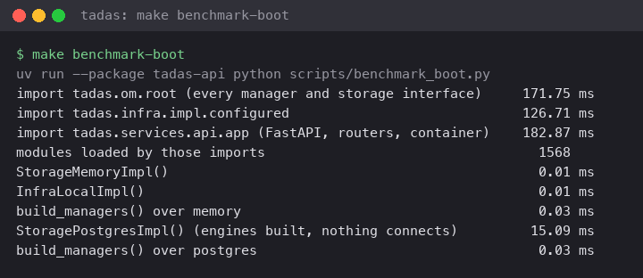
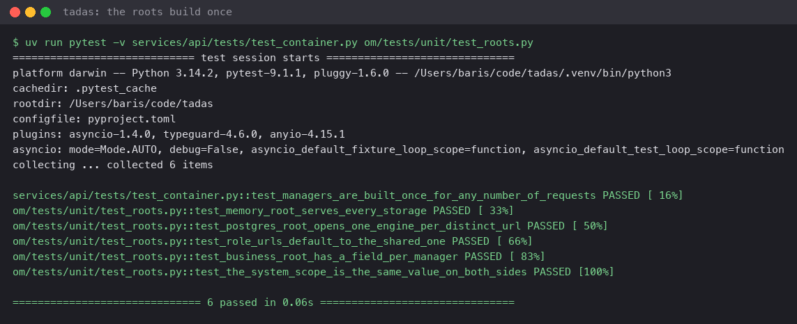

# ADR 0007: Roots are built whole at boot, once per process

**Status**: accepted (2026-09-18)

## Context

`build_managers` constructs every manager at boot, and the storage and
infra roots construct every namespace impl and every capability impl
the same way, whether or not the process ever calls them. The
question was whether a lazy root (a manager built on first use) would
make a process that serves a narrow flow cheaper.

Measured on this tree (`make benchmark-boot`, warm, Apple silicon):

| Step                                                      | Cost      |
|-----------------------------------------------------------|-----------|
| import `tadas.om.root` (every manager and storage module)  | ~160 ms   |
| import `tadas.infra.impl.configured`                       | ~125 ms   |
| import `tadas.services.api.app` (FastAPI, routers)         | ~165 ms   |
| `StorageMemoryImpl()`, `InfraLocalImpl()`                  | ~0.01 ms  |
| `build_managers()` over either storage root                | ~0.03 ms  |
| `StoragePostgresImpl()` (engines built, nothing connects)  | ~9 ms     |

The cost of a root is its imports, and imports are paid once per
process at module load, before any constructor runs. Construction
itself is microseconds: an impl holds references and opens nothing.
Connections open at `start()` or on first use (the engine pool), not
in a constructor. Nothing is built per request: routers resolve the
one `Managers` object the container holds, and
`services/api/tests/test_container.py` asserts that
`build_managers` runs once for any number of requests.

## Decision

Roots stay whole and upfront. `build_managers`, both storage roots,
the configured infra root, and the services root construct every
member at boot, once per process, in dependency order.

A lazy root is refused because it would save nothing measurable and
would move a wiring error from boot, where the process exits and the
readiness probe stays red, to the first request that needs the
missing piece, where a probe already reports ready. Lazy imports are
refused for the same reason: they move the same ~450 ms from boot to
a request's tail latency.

The costs that remain are accepted as what they are: a short-lived
process (`tadas-api migrate`, `tadas` in command mode) pays the
imports of the packages it names once per invocation, about 100 ms
for the CLI, and that is the floor a Python process has.

## Consequences

A new manager is one line in `Managers` and one call in
`build_managers`, never a getter that builds on demand. The
per-scope caches in the infra roots follow the same rule: one per
`CacheScope`, built in the constructor, so `describe()` names every
one at boot and `get_cache` is a lookup. A scope is a name, not a
connection, so building them all costs nothing.

`make benchmark-boot` is the re-test: run it when a root or a dependency
changes and compare the table above. A change that moves a
constructor above a millisecond, or that opens a connection in one,
is a finding. The import floor moves only when a dependency is added
or dropped; that is visible in the same table.

## Evidence

