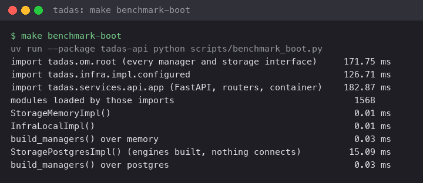
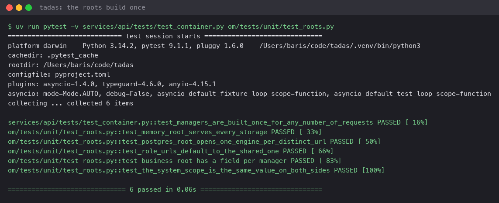

# ADR 0007: Roots are built whole at boot, once per process

**Status**: accepted (2026-09-18)

## Context

`build_managers` constructs every manager at boot. The storage and
infra roots construct every namespace impl and every capability impl
the same way, whether or not the process calls them. A lazy root, a
manager built on first use, could make a process that serves a narrow
flow cheaper.

Measured with `make benchmark-boot` (warm, Apple silicon):

| Step | Cost |
|------|------|
| import `tadas.om.root` (every manager and storage module) | ~160 ms |
| import `tadas.infra.impl.configured` | ~125 ms |
| import `tadas.services.api.app` (FastAPI, routers) | ~165 ms |
| `StorageMemoryImpl()`, `InfraLocalImpl()` | ~0.01 ms |
| `build_managers()` over either storage root | ~0.03 ms |
| `StoragePostgresImpl()` (engines built, nothing connects) | ~9 ms |

A root costs its imports, paid once per process at module load, before
any constructor runs. Construction takes microseconds: an impl holds
references and opens nothing. Connections open at `start()` or on first
use of the engine pool, never in a constructor. Nothing is built per
request: routers resolve the one `Managers` object the container holds,
and `services/api/tests/test_container.py` asserts that
`build_managers` runs once for any number of requests.

## Decision

Roots are whole and built up front. `build_managers`, both storage
roots, the configured infra root, and the services root construct every
member at boot, once per process, in dependency order.

A lazy root is refused. It saves nothing measurable, and it moves a
wiring error from boot, where the process exits and the readiness probe
stays red, to the first request that needs the missing piece, after the
probe reports ready. Lazy imports are refused too: they move the same
~450 ms from boot to a request's tail latency.

A short-lived process (`tadas-api migrate`, `tadas` in command mode) pays
the imports of the packages it names once per invocation, about 100 ms
for the CLI: the floor a Python process has.

## Consequences

A new manager is one line in `Managers` and one call in
`build_managers`, never a getter that builds on demand. The infra roots
build one cache per `CacheScope` in the constructor, so `describe()`
names every one at boot and `get_cache` is a lookup. A scope is a name,
not a connection, so building them all costs nothing.

`make benchmark-boot` is the re-test: run it when a root or a
dependency changes, and compare with the table above. A constructor
above a millisecond, or one that opens a connection, is a finding. The
import floor moves only when a dependency is added or dropped.

## Evidence

