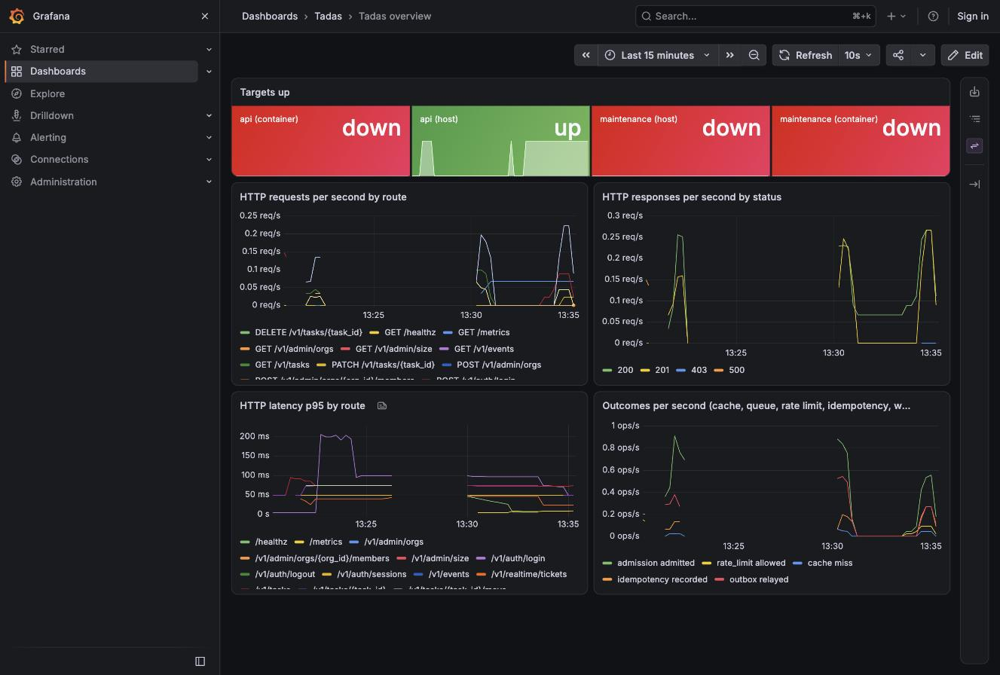
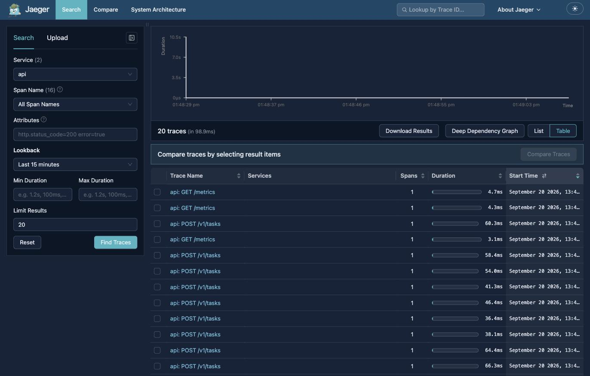

# Operations

How Tadas is operated once it runs. People steer, agents maintain:
every operational task is a skill a person runs with an agent, and the
safety boundary is the credential the skill holds, never the prompt. A
credential that can only read cannot break anything, so an agent
holding one may look at everything. A credential that writes is held
by a pipeline, or by a person for one named step.

## Roles and profiles

One cloud role per role per environment, and one named profile for
each. No role a person or an agent holds can write to the cloud; a
change is a pull request.

| Role | Held by | May | Profile |
|------|---------|-----|---------|
| Administrator | a person | create and destroy an environment; nothing else | `tadas-admin` |
| Deployer | the pipeline, through OIDC | apply staging; plan and apply production | none: the workflow's own |
| Investigator | an agent, or a person | read every signal and every resource description, plan Terraform; never a secret's value, a data bucket's object, or a database login | `tadas-staging-investigate`, `tadas-production-investigate` |
| Supporter | an agent, or a person | Investigator, plus the operator plane's read of one named org | the investigate profile, plus a read operator identity |

The agents' principal is one user, `tadas-operators`, whose only
permission is to assume the investigate roles; the two investigate
profiles chain from its profile. Everything the investigate roles are
denied is a fence in the role itself, not a rule in a skill.

`local` is an environment too. Its signals are the compose stack's
Prometheus, Jaeger, and GlitchTip, so every skill is testable with no
cloud.

## Credentials

- The cloud profiles live in the operator's own AWS configuration,
  never in the repository.
- The application credentials live in one owner-only file per
  environment outside the repository, `~/.config/tadas/ops/<env>.env`:
  the API URL, the operator's email and password (a read entry on the
  allowlist, what every read runs as), the provisioner's email and
  password (a write entry, used by the traffic generator alone to
  create the tenants a run needs), and the error tracker's URL and
  token.
- A skill names the profile it needs, verifies which identity it holds
  before it runs, and refuses to run under a wider one.
- The platform's own secrets live in the secret store. No secret is in
  the repository, in a skill's text, or in a document.

## The signals

Both twins expose the same four signals through a read API, so one
skill reads either.

| Signal | Locally | In the cloud |
|--------|---------|--------------|
| Logs | the process's own output | CloudWatch Logs Insights, one log group per process per environment |
| Metrics | Prometheus | CloudWatch metrics, namespace `Tadas` |
| Traces | Jaeger | X-Ray |
| Errors | GlitchTip | Sentry |

What the local twin shows after thirty seconds of light traffic, the
wiring check CI runs. The five panels of the Grafana dashboard are the
five the CloudWatch dashboard carries, by title:

Jaeger with the traces of the same run, one server span per request,
found by the `tadas.request_id` attribute:

Every line, span, and error event carries the request id, so one id
is enough to follow a request through all four.

**The dashboard.** One per environment, `tadas-<env>` in CloudWatch,
with the same panels as Grafana's overview locally: targets up, HTTP
requests per second by route, HTTP responses per second by status,
HTTP latency p95 by route, outcomes per second; plus one row for the
database, the cache, and the queue. A test holds the shared titles
equal between the two definitions.

**The alarms.** Six per environment, to one topic, `tadas-<env>-alarms`,
with an email subscription: the load balancer's 5xx ratio, unhealthy
targets, database CPU, database free storage, running tasks below
desired for the API and the worker, and the load balancer's p95
latency. The numbers are the team's; the shape is not.

**Cost.** A budget per account with alerts at 50, 80, and 100 percent
actual and 100 percent forecast, and an anomaly monitor, both to the
owner.

## The binary

`tadas-ops` is the operators' one command. It rides the Python client
and the operator plane, and it holds a read credential.

| Subcommand | Does |
|------------|------|
| `traffic --env <e> --profile light\|regular\|heavy\|stress [--duration S] [--report path]` | Drives realistic sessions at the edge and reports requests by route and status, p50, p95, p99, and the error ratio. |
| `stress --scenario ops/stress/<name>.yaml` | The same generator at a profile with a duration, a ramp, and a target; reads the signals back after the run. |
| `signals check --env <e> --request-id <id>` | Reads the log lines, the metric, the trace, and the error event for one request id. |
| `size --env <e>` | The platform's size: orgs, users, and the tasks of the last twenty-four hours. |

## The skills

Nine, under `.claude/skills/`. Every one takes
`--env local|staging|production`, names the role it needs, what it
reads, what it never does, and its report.

| Skill | Needs | Answers |
|-------|-------|---------|
| `ops-investigate` | Investigator | What is the state of this environment right now: the dashboard's panels, the alarms, the recent errors. |
| `ops-watch` | Investigator | Has anything changed since the last look; a periodic read of the same signals. |
| `ops-root-cause` | Supporter | Why did this request, or this org's problem, happen: the request id followed through every signal, and the org's records on the operator plane. |
| `ops-infra-as-code` | Investigator | What would this Terraform change do: a plan, read-only, against the live environment. |
| `ops-cloud-deployment-create` | Administrator | Bring up an environment: the state backend, the shared account resources, the pipeline's variables, then the first deploy through the pipeline. |
| `ops-cloud-deployment-nuke` | Administrator | Tear an environment down. Refuses production unless deletion protection was lifted in a prior pull request and the name is typed; reports what is left. |
| `ops-simulate-traffic` | Supporter | What does the platform look like under realistic traffic at a profile. |
| `stress-test-create-or-update` | none | Write or change a scenario file, with a target stated before any run. |
| `stress-test-run` | Supporter | Run a scenario, read the signals back, and say whether the target held. |

## The first responder

The first responder is an agent. An alarm is read against the
platform's size first: the orgs, the users, and the traffic of the
last day. A 5xx ratio over ten requests an hour and one over ten
thousand a minute are different findings. Only then is it escalated,
with the size, the signals for one request id, and what changed.

## What an operator never does

- Never writes to the cloud. A change is a pull request, and the
  pipeline applies it.
- Never logs in to a database. The operator plane answers what a
  support case needs, and the role denies the connection.
- Never prints a secret. A skill verifies its identity and reads what
  the read role allows; a secret's value is outside that.
- Never reads telemetry by tenant. Telemetry carries no tenant id; a
  tenant's view is a product screen over the org's own diary.

The support runbook says how one investigation runs:
[docs/runbooks/support.md](../docs/runbooks/support.md). Stress tests
are described in [ops/stress/README.md](stress/README.md).
